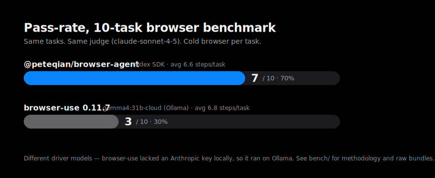

<div align="center">

# @peteqian/browser-agent

### Hands and eyes for your model.

TypeScript browser-automation agent. Raw Chrome DevTools Protocol + an LLM decision loop. Domain-agnostic. CLI + SDK + MCP.

[](https://www.npmjs.com/package/@peteqian/browser-agent)
[](https://github.com/peteqian/agent-browser/actions/workflows/ci.yml)
[](./LICENSE)
[](#)

</div>

---

## Why

Your model can reason, plan, write code. It can't open a tab, dismiss a cookie banner, click "Continue with Google", or scroll past a paywall. This package gives it that reach.

- **Raw CDP, no Puppeteer/Playwright in the chain.** Smaller surface, fewer fingerprints, faster startup.
- **Bring any model.** OpenAI, Anthropic, Codex CLI, Codex Agent SDK, Claude CLI, Claude Agent SDK — or your own `getNextAction`.
- **Built-in MCP server.** Drop into Claude Desktop, Cursor, or any MCP client without writing glue.
- **First-class CLI.** `browser-agent "task..."` and go.
- **Vision when it helps.** Screenshots forwarded to multimodal endpoints automatically.
- **Typed terminal output.** `done(data=...)` validated against a Zod schema.
- **Resilient loop.** Loop detection, step + decision timeouts, abort/stop control, head+tail history compaction.

## Benchmark



10 tasks across 5 categories; identical task list and judge on both sides. Different driver models — see [`bench/`](./bench/) for methodology, per-task verdicts, and raw bundles.

## Install

```bash
npm install @peteqian/browser-agent
# or
bun add @peteqian/browser-agent
```

Requirements: **Node ≥ 18** or **Bun ≥ 1.3** + any Chrome-based browser.

## Quickstart

```ts
import { Agent, Browser } from "@peteqian/browser-agent";

const browser = new Browser();
const agent = new Agent({
  task: "Go to example.com and report the H1 text.",
  browser,
  startUrl: "https://example.com",
});

try {
  console.log((await agent.run()).summary);
} finally {
  await browser.close();
}
```

That's it. Default provider auto-resolves to whatever's signed in locally (Codex → Claude → OpenAI/Anthropic by API key).

### Pin a provider

```ts
const agent = new Agent({
  task: "Find the top Hacker News story.",
  browser,
  startUrl: "https://news.ycombinator.com",
  llm: { provider: "openai", model: "gpt-4.1-mini" },
});
```

### Typed terminal output

```ts
import { z } from "zod";
import { Agent, Browser } from "@peteqian/browser-agent";

const Result = z.object({ heading: z.string() });

const result = await new Agent({
  task: "Report the page heading via done(data=...).",
  browser: new Browser(),
  startUrl: "https://example.com",
  outputSchema: Result,
}).run();

if (result.success) console.log(result.data?.heading);
```

### Drive the browser directly

```ts
import { Browser } from "@peteqian/browser-agent";

const browser = new Browser();
const page = await browser.newPage();
await page.goto("https://example.com");
console.log(await page.title());
await browser.close();
```

## CLI

```bash
browser-agent "Find the top result on Hacker News and print its title."
browser-agent "..." --provider openai --model gpt-4.1-mini
browser-agent "..." --verbose       # JSONL diagnostics on stderr
browser-agent --probe --provider claude
```

Run `browser-agent --help` for the full flag list.

## MCP server

Spawn `browser-agent-mcp` as a stdio MCP server. Drop into `claude_desktop_config.json`:

```json
{
  "mcpServers": {
    "browser-agent": {
      "command": "npx",
      "args": ["-y", "-p", "@peteqian/browser-agent", "browser-agent-mcp"]
    }
  }
}
```

Tools exposed: launch session, navigate, click, type, extract, screenshot, run agent, list artifacts, close. See `src/mcp/` for the catalog.

## Providers

| Flag                           | Backend                                       | Auth                                     |
| ------------------------------ | --------------------------------------------- | ---------------------------------------- |
| `--provider codex` _(default)_ | Codex Agent SDK → Codex CLI                   | `codex` signed in                        |
| `--provider claude`            | Claude Agent SDK → Claude CLI → Anthropic API | `claude` signed in / `ANTHROPIC_API_KEY` |
| `--provider openai`            | OpenAI Chat Completions                       | `OPENAI_API_KEY`                         |
| `--provider anthropic`         | Anthropic Messages                            | `ANTHROPIC_API_KEY`                      |

`--base-url` overrides the SDK base URL (OpenAI-compatible endpoints, local servers, gateways).

## Actions

The model emits actions from this catalog (full schemas in `src/actions/types.ts`):

`navigate` · `click` · `type` · `scroll` · `wait` · `send_keys` · `select_option` · `upload_file` · `wait_for_text` · `go_back` · `go_forward` · `refresh` · `new_tab` · `switch_tab` · `close_tab` · `close_browser` · `search_page` · `find_elements` · `get_dropdown_options` · `find_text` · `screenshot` · `save_as_pdf` · `extract_content` · `done`

Add your own via `createDefaultActionRegistry()` + custom `ActionDefinition`.

## `AgentResult`

- `success` — `true` only when `reason === "completed"`.
- `reason` — branch on this in production: `completed`, `failed`, `max_steps`, `max_failures`, `loop_detected`, `aborted`, `stopped`, `step_timeout`, `decision_timeout`, `schema_violation`, `decide_error`.
- `summary` — human-readable, not for control flow.
- `data` — `TData | null`, validated against `outputSchema`.
- `steps` — iterations executed.

## Internal subpath

Anything beyond the public surface lives under `/internal` and carries **no stability guarantee**:

```ts
import { CDPClient, launchBrowser, executeAction } from "@peteqian/browser-agent/internal";
```

## Development

```bash
bun install
bun run typecheck     # tsc --noEmit
bun run lint          # oxlint
bun run fmt           # oxfmt
bun run test          # bun test
bun run build         # tsup -> dist/
bun run dev:cli       # CLI from source
bun run dev:mcp       # MCP server from source
```

Examples in `examples/` — `bun run example:goto`, `example:agent`, `example:openai`, `example:typed-output`, `example:extraction`, `example:mcp`, etc.

## For AI agents

Skip this README — read [`docs/ai/`](./docs/ai/README.md) instead. It splits architecture, contracts, commands, conventions, and troubleshooting into focused files. `AGENTS.md` and `CLAUDE.md` at the root are thin pointers to the same folder.

## License

[MIT](./LICENSE) © Peter Qian
