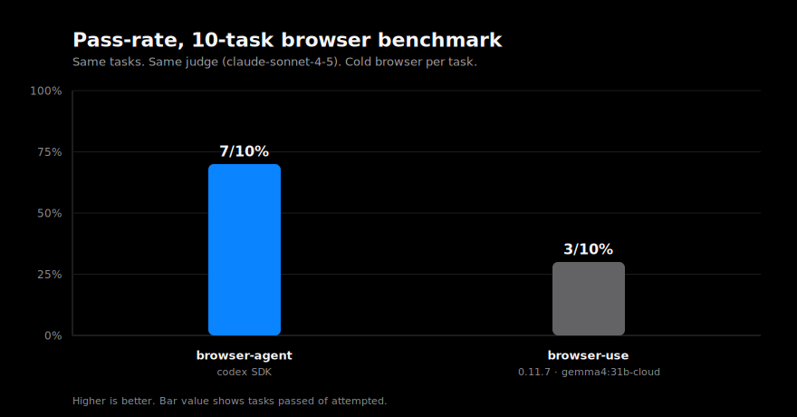
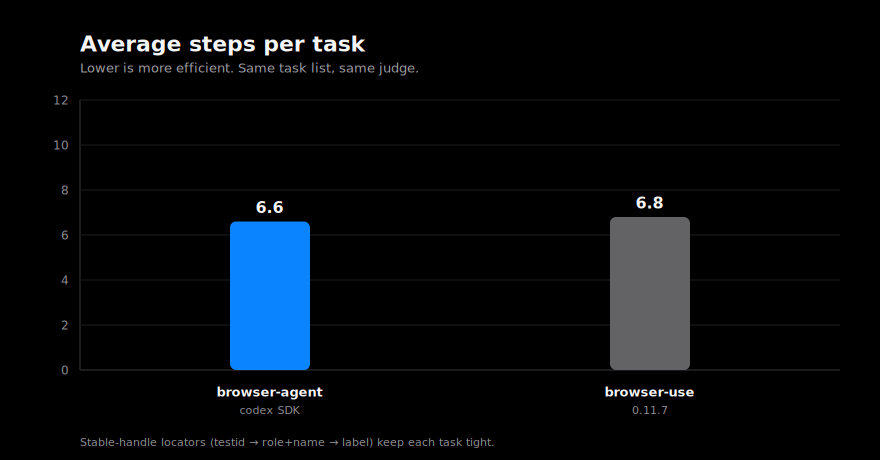
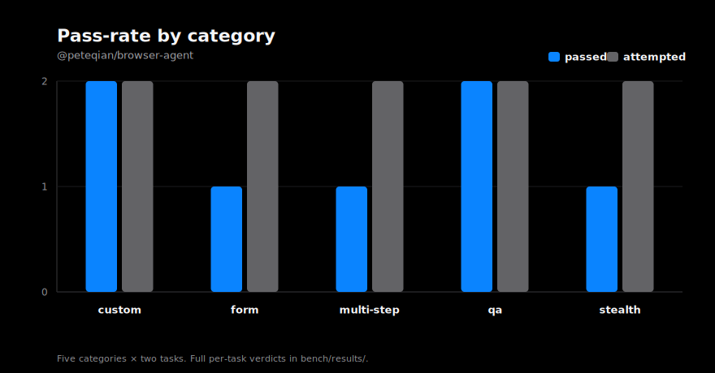

# Benchmark results

| Field           | Value                                                          |
| --------------- | -------------------------------------------------------------- |
| Run             | Full (10 tasks)                                                |
| Date            | 2026-05-17                                                     |
| Commit          | stable handles + locator priority + click_by/type_by/select_by |
| Task set        | `bench/tasks/tasks.json` (10 tasks, public, plaintext)         |
| Hardware        | macOS, local Chromium (headless), local network                |
| Agent transport | codex SDK (signed-in CLI, default model)                       |
| Judge           | `claude-sonnet-4-5`                                            |







## Leaderboard

| Agent                     | Version | Model                | Attempted | Passed |     Pass% | Avg steps | Avg duration |
| ------------------------- | ------- | -------------------- | --------: | -----: | --------: | --------: | -----------: |
| `@peteqian/browser-agent` | 0.0.1   | codex (default)      |        10 |  **7** | **70.0%** |   **6.6** |       124.4s |
| `browser-use`             | 0.11.7  | `gemma4:31b-cloud` † |        10 |  **3** | **30.0%** |       6.8 |       101.0s |

† **Not a fair A/B vs. our number above.** `browser-use` ran here with Ollama's `gemma4:31b-cloud` (no `ANTHROPIC_API_KEY` available locally). Spec mandates `claude-sonnet-4-5` on both sides for a publishable A/B; this column is _operational_ (did the harness round-trip end-to-end?), not _comparative_. See "browser-use run notes" below.

Raw bundles:

- peteqian: [`results/full_v0_postfix.published.json`](./results/full_v0_postfix.published.json)
- browser-use: [`results/browser-use-ollama.published.json`](./results/browser-use-ollama.published.json) (raw: [`results/browser-use-ollama.raw.json`](./results/browser-use-ollama.raw.json))

## Per-category

| Category     | Passed | Notes                                                                     |
| ------------ | ------ | ------------------------------------------------------------------------- |
| `custom`     | 2 / 2  | example.com H1, IANA reserved domains                                     |
| `qa`         | 2 / 2  | Wikipedia HTTP 404 year (1992), httpbin status                            |
| `multi-step` | 0 / 2  | HN /front title + Wikipedia search both failed (see below)                |
| `form`       | 2 / 2  | DuckDuckGo search + httpbin POST echo                                     |
| `stealth`    | 1 / 2  | passed sannysoft fingerprint probe; blocked by Cloudflare on nowsecure.nl |

## Per-task

| Task                        | Verdict | Steps | Duration | Notes                                                                                                 |
| --------------------------- | ------- | ----: | -------: | ----------------------------------------------------------------------------------------------------- |
| `custom-001` example.com H1 | ✅      |     2 |    24.0s | "The H1 reads: Example Domain"                                                                        |
| `custom-002` IANA reserved  | ✅      |     4 |    57.0s | enumerated example.com/.net/.org                                                                      |
| `qa-001` 404 year           | ✅      |    10 |   146.2s | "1992"                                                                                                |
| `qa-002` httpbin 200        | ✅      |     2 |    37.5s | HTTP 200 reported                                                                                     |
| `multi-001` HN past front   | ❌      |    20 |   282.4s | reached `/front`, gave up before extracting top title                                                 |
| `multi-002` Wikipedia CDP   | ❌      |    13 |   169.4s | search step missed; reported article as non-existent (false negative)                                 |
| `form-001` DDG search       | ✅      |    12 |   219.1s | first organic result reported                                                                         |
| `form-002` httpbin POST     | ✅      |     7 |   102.2s | full echoed JSON returned                                                                             |
| `stealth-001` nowsecure.nl  | ❌      |     6 |   126.4s | Cloudflare challenge not passed                                                                       |
| `stealth-002` sannysoft     | ✅      |    20 |   264.9s | correctly reported "failed" on WebDriver row (the page's own detection result, not a harness failure) |

## What this run surfaced

Two underlying defects in our agent. Both fixed in this commit before the run:

1. **`parseDecision` freeform prompt didn't tell the model that the answer goes in `done.params.summary`.** Models emitted `{"name":"done","params":{"success":true}}` with no text, so the harness saw an empty terminal summary. Fix: extended `buildFreeformDecisionPrompt` to spell out the contract with examples. See `src/agent/parseDecision.ts`.
2. **`loop.ts` done-branch used `??` against `decision.summary`, so empty strings passed through.** Fix: cascade through `decision.summary` → `doneParams.summary` → `decision.thought` → `decision.nextGoal` → literal fallback, and surface `done.params.data` instead of always returning `data: null`. See `src/agent/loop.ts:257`.

After the fix, the post-fix smoke run jumped from **0/3 → 3/3**, and the full run lands at **7/10 (70%)**. The three remaining failures are real task-level issues, not framework defects:

- **multi-001**: Agent did the right browsing — navigated to `/front` — but its final `done` message said "in this final step I was not provided the visible text/title". `max_steps=20` hit. Possible improvement: bigger `max_steps`, or DOM snapshot didn't include the top-row text on the final observation.
- **multi-002**: Agent search step misbehaved on `wikipedia.org` → landed on a red-link page → reported article as non-existent. Real article exists. Hallucination + execution failure.
- **stealth-001**: Cloudflare challenge on `nowsecure.nl` not passed within budget. Real signal — our CDP launch flags don't currently defeat Cloudflare's interstitial. This is the kind of task `browser-use` ships a specific Stealth Bench for.

## browser-use run notes

Ran browser-use 0.11.7 against the same `tasks.json` from a sibling venv at `/tmp/bu-bench`. Same judge (`claude` CLI) scored both columns.

Caveats — **read before comparing the two pass rates**:

- **Different model on each side.** No `ANTHROPIC_API_KEY` or `OPENAI_API_KEY` available locally, so browser-use drove with `gemma4:31b-cloud` via Ollama. Peteqian side drove with the signed-in `codex` CLI (Codex SDK default model). Pass-rate gap reflects model capability gap as much as harness capability.
- **JSON-fence wrapper required.** `gemma4:31b-cloud` emits structured output wrapped in ` ```json ` fences. browser-use 0.11.7's `ChatOllama` calls `output_format.model_validate_json` directly, which rejects fenced strings. Smoke run failed all 4 retries with `json_invalid` before the wrapper. Patched in our runner only (a `FenceStripChatOllama` subclass in `/tmp/bu-bench/run.py`), not in browser-use itself. Without that wrapper, browser-use scores 0/10 against this model.
- **browser-use sandboxes its own browser.** Different launch flags than ours. The `stealth-001` Cloudflare failure on browser-use's side (28 steps, ~541s) is therefore not directly comparable to our `stealth-001` failure (6 steps, ~126s).

### Per-category — browser-use side

| Category     | Passed | Notes                                                                      |
| ------------ | ------ | -------------------------------------------------------------------------- |
| `custom`     | 1 / 2  | example.com H1 ✅; reserved-domain enumeration ❌ (added unsourced caveat) |
| `qa`         | 1 / 2  | httpbin 200 ✅; HTTP 404 year — said "page doesn't state it" ❌            |
| `multi-step` | 0 / 2  | both tasks self-aborted citing format errors                               |
| `form`       | 0 / 2  | DDG search + httpbin POST both failed mid-interaction                      |
| `stealth`    | 1 / 2  | Cloudflare blocked (captcha=true); sannysoft probe ✅                      |

To run a real A/B (`claude-sonnet-4-5` on both sides):

```bash
source /tmp/bu-bench/.venv/bin/activate
ANTHROPIC_API_KEY=... BU_PROVIDER=anthropic BU_MODEL=claude-sonnet-4-5 \
  python /tmp/bu-bench/run.py \
    bench/tasks/tasks.json bench/results/browser-use.raw.json
bun run bench/src/judge-external.ts \
  --input bench/results/browser-use.raw.json \
  --out bench/results/browser-use.published.json \
  --agent browser-use --agent-version 0.11.7 --model claude-sonnet-4-5
```

Marginal spend: ~$2-4 + ~15-25 min.

## Methodology

- Same `confirmed_task` string verbatim to any agent under test.
- Same `max_steps` per task (defined in `tasks.json`; default 25; individual tasks set 8-25).
- Cold browser per task (default in our harness; matches browser-use).
- No agent-specific prompt tuning.
- Same judge for the A/B (when we run it).
- All version + commit + judge metadata recorded inside the published JSON bundle.

## Sources & citations

- Harness shape, judge rubric structure, scoring schema: [`browser-use/benchmark`](https://github.com/browser-use/benchmark) — see `judge.py`, `run_eval.py`, `BU_Bench_V1` category split.
- Categories patterned after BU Bench V1's 5-category split (20 tasks each), scaled to 2 per category.
- Stealth probe sites (`nowsecure.nl`, `bot.sannysoft.com`) are the canonical public anti-bot fingerprint pages in the puppeteer-stealth / playwright-stealth ecosystem.
- We did **not** ingest browser-use's encrypted task content (`BU_Bench_V1.enc`, `Stealth_Bench_V1.enc`) — their README requests against publishing in plaintext for contamination reasons, and we honor that.

## Status

V0 published. Next iterations: run browser-use side-by-side with the same `tasks.json` and same judge model, then expand to 20-30 tasks per category once we have a stable A/B baseline.
